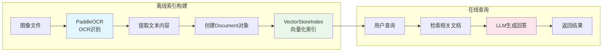

# ImageOCRReader 实验结果分析报告

## 1. 架构设计图：

## 2. 核心代码说明
关键函数：load_data
关键步骤：
- OCR图片识别
- OCR结果文本拼接
- OCR结果转化为Documents

## 3. OCR效果评估
针对纯文本扫描和简单实体场景扫描效果很好，但是对结构化文本的处理方式效果欠佳，丢失了结构信息。

## 4. 错误案例分析
表格信息丢失了原有结构

## 5. Document 封装合理性讨论
应该针对不同场景的OCR单独处理，统一使用文本拼接方式会导致部分信息丢失。
增加元数据有助于后续检索时先进行元数据过滤，缩小查询范围，在知识库数据量大的场景下会比较实用，同时对于问题的溯源也有很大的帮助。

## 6. 局限性与改进建议：如何保留空间结构（如表格）
可以选择合适的SDK或者OCR模型来提高结果的质量。或者通过多次扫描，分别提取文字和图片或者表格再进行关联的方式减少信息的丢失。